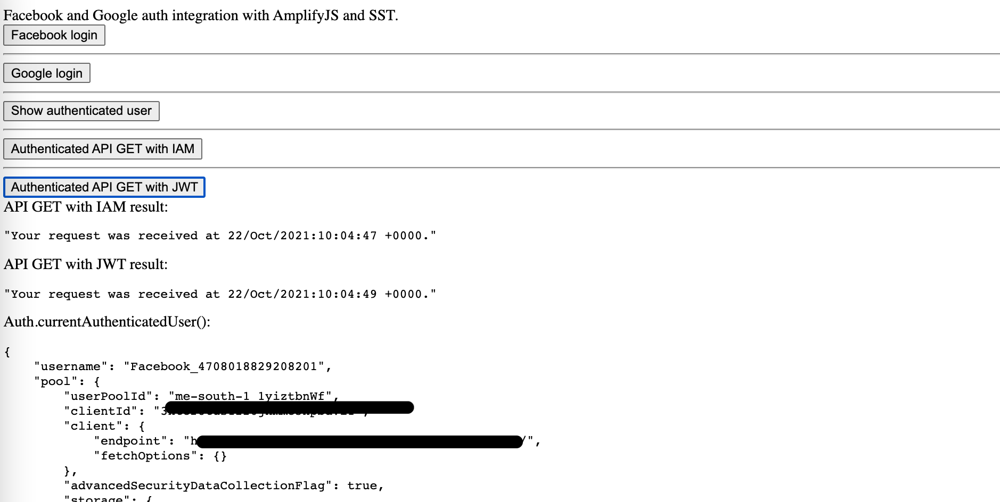
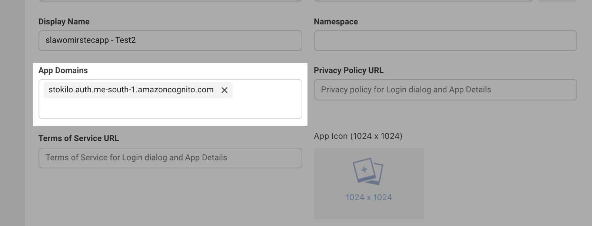
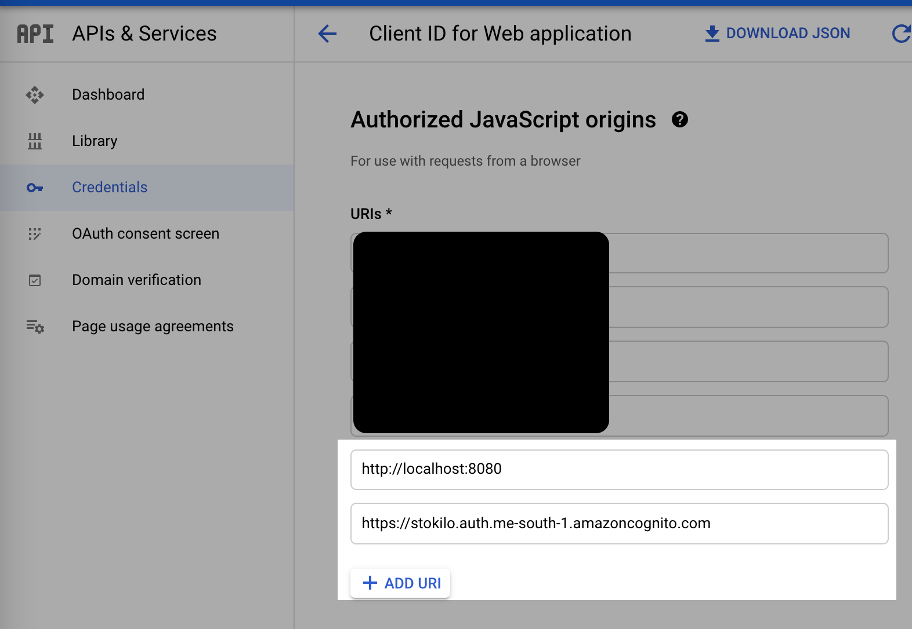
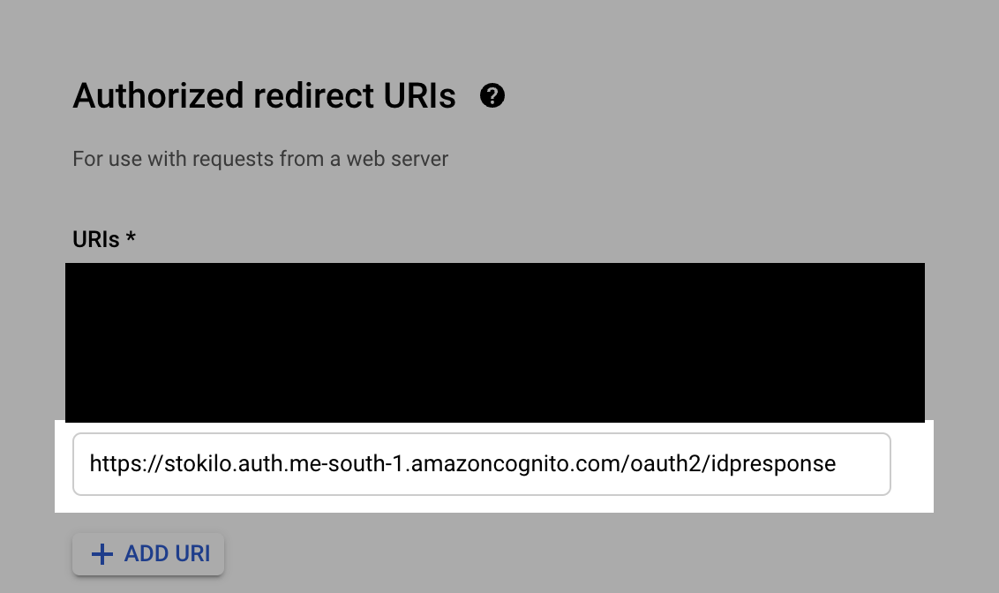

#### What is it?

This is a sandbox project for testing Cognito and frontend app deployment to the Cloudflare workers.
It includes:

1. Facebook and Google providers for Cognito identity and user pools.
2. Integrates auth modules from Amplify library.
3. JWT and IAM API endpoint to test 1 & 2
4. Cloudflare worker integration to deploy Vue SPA to the cloud from CLI.

Sandbox index page for testing login/amplify model output/testing JWT/IAM requests:

  

NuxtJs + Vue 2.x + user pool integration with amplify version is here:
https://github.com/stokilo/sst-frontend-plus-cognito-nuxtjs

Note: all credentials for this setup are stored under single AWS secret with name:

```/account/api/secrets``` 

Secret is not provisioned. Must be created by hand using AWS Console. Values are described in sections below.

### Facebook Login setup

Create new test application using Facebook for developers platform.

Select 'Add Product' and select Facebook Login. 

Copy values from:

  

Login to AWS Secrets Manager->Store Secret

/account/api/secrets

Add two keys

FACEBOOK_CLIENT_SECRET

FACEBOOK_CLIENT_ID

Set Website URL:

Copy domain name from AWS Cognito admin panel:

  

To Facebook admin panel Basic->Settings->Website:
Append to the URL following path: `/oauth2/idpresponse`

  

Add Website URL to App Domains under Basic->Settings->App Domains
  

### Google Login setup

Create new application:

  

Login to AWS Secrets Manager->Store Secret

/account/api/secrets

Add two keys

GOOGLE_CLIENT_SECRET

GOOGLE_CLIENT_ID

Copy domain name from AWS Cognito admin panel:

  


Add auth origins

  


Add authorized URIs

Append to the URL following path: `/oauth2/idpresponse`

  

#### Cloudflare setup

Login to AWS Secrets Manager->Store Secret

/account/api/secrets

Add 3 keys

CLOUDFLARE_ACCOUNT_ID

CLOUDFLARE_ZONE_ID   

CLOUDFLARE_API_TOKEN

where account and one ids should be copied from Cloudflare admin interface.
Api token should be generated from 'worker template' with adjusted permissions and zone id.

Edit wrangler.toml and fill:

account_id=
zone_id=

replace *stokilo.com domains mapping with your own:

name
routes

for dev and prod profiles. 

  

#### Domain setup 

To keep it simple domain names are hardcoded in all files and not read from env variables.
Search and Replace all instances of 'stokilo.com' domain with your own.

#### Backend 

Start by installing the dependencies.

```bash
$ yarn install
```

Deploys server cloudformation stack to the AWS and frontend app to the Cloudflare worker.
Two stages are coded in the npm scripts (dev and prod):

```bash
$ yarn deploy-dev
$ yarn deploy-prod
```

Start development with live lambda reload

```bash
$ yarn start
```

#### Frontend 

Navigate to the frontend source dir:
```bash
$ cd frontend
```

Development mode
```bash
$ yarn install
$ yarn serve
```

Build for production
```bash
$ yarn build
```

Build for production and deploy to the Cloudflare PROD or DEV worker instance
```bash
$ yarn deploy-dev
$ yarn deploy-prod
```
